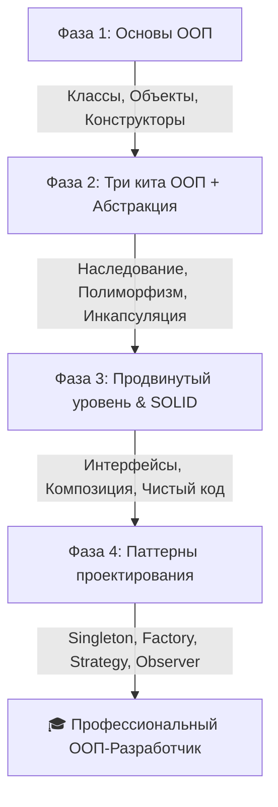

# 🎓 Подробный Роадмап изучения ООП на Java (от Новичка до Паттернов)

> [!NOTE]
> Данное руководство составлено специально для тех, кто никогда ранее не сталкивался с объектно-ориентированным программированием. Путь разбит на 4 понятные фазы с возрастающей сложностью, практическими заданиями на Java и ссылками на лучшие ресурсы.

---

---

## 🛠 Фаза 1: Введение в объекты (Основы)

### 1. Темы для изучения
* **Что такое объект и класс?** Класс как чертёж/шаблон (Blueprint), Объект как реальный экземпляр (Instance) класса.
* **Поля (Атрибуты) и Методы:** Состояние объекта (переменные) и его поведение (функции).
* **Конструкторы:** Зачем они нужны? Конструктор по умолчанию и параметризованные конструкторы. Ключевое слово `this`.
* **Жизненный цикл объекта:** Создание через оператор `new` и сборщик мусора (Garbage Collector - базово).

### 📝 Практические задания на Java
1. **«Создай своего питомца»:** 
   * Напишите класс `Dog` с полями `name` (имя), `age` (возраст) и `breed` (порода).
   * Добавьте конструктор, инициализирующий все три поля.
   * Напишите метод `bark()`, который выводит в консоль: `"Гав! Меня зовут [Имя], мне [Возраст] лет"`.
2. **«Учёт книг в библиотеке»:**
   * Создайте класс `Book` с полями `title`, `author`, `year`.
   * Напишите конструктор по умолчанию (задающий значения `"Неизвестно"`) и конструктор со всеми параметрами.
   * Добавьте метод для вывода информации о книге.

### 🌐 Полезные источники
* [W3Schools Java Classes/Objects](https://www.w3schools.com/java/java_classes.asp) — Идеально для первого знакомства (кратко, интерактивно).
* [CodeGym (Java Syntax)](https://codegym.cc/) — Отличная геймифицированная платформа с сотнями задач на создание классов.
* [Oracle Java Tutorials - Objects](https://docs.oracle.com/javase/tutorial/java/javaOO/index.html) — Официальное руководство, подробно объясняющее основы.

---

## 🏛 Фаза 2: Четыре столпа ООП (Смысловое ядро)

### 1. Темы для изучения
* **Инкапсуляция (Encapsulation):** Сокрытие внутренних данных объекта. Модификаторы доступа (`private`, `public`, `protected`, default). Геттеры (`get`) и сеттеры (`set`), валидация данных внутри сеттеров.
* **Наследование (Inheritance):** Повторное использование кода. Ключевое слово `extends`. Родительский класс (Superclass) и дочерний класс (Subclass). Ключевое слово `super`.
* **Полиморфизм (Polymorphism):** Одно имя — много форм.
  * *Перегрузка методов (Overloading)* — статический полиморфизм (одинаковое имя, разные параметры).
  * *Переопределение методов (Overriding)* — динамический полиморфизм (аннотация `@Override`).
* **Абстракция (Abstraction):** Описание только важных деталей. Абстрактные классы (`abstract`) и интерфейсы (`interface`). Различия между ними.

### 📝 Практические задания на Java
1. **Инкапсуляция («Безопасный Банковский Счёт»):**
   * Создайте класс `BankAccount`. Поле `balance` должно быть строго `private`.
   * Реализуйте метод `deposit(double amount)` (пополнение) и `withdraw(double amount)` (снятие денег). Сделайте так, чтобы нельзя было снять больше денег, чем есть на счету, или положить отрицательную сумму.
   * Добавьте геттер для баланса.
2. **Наследование и Полиморфизм («Экосистема транспорта»):**
   * Создайте базовый класс `Vehicle` с методом `startEngine()`.
   * Создайте дочерние классы `Car` и `Bicycle`.
   * Переопределите метод `startEngine()` в `Car` (вывод: `"Ррр! Двигатель машины запущен"`) и в `Bicycle` (вывод: `"У велосипеда нет двигателя, крути педали!"`).
   * В методе `main` создайте массив `Vehicle[]` и вызовите `startEngine()` для каждого элемента в цикле, чтобы увидеть полиморфизм в действии.

### 🌐 Полезные источники
* [Refactoring.Guru - OOP Basics](https://refactoring.guru/ru/oop) — Самое наглядное объяснение столпов ООП с картинками на русском языке.
* [Baeldung - Java OOP](https://www.baeldung.com/java-oop) — Глубокие и качественные статьи по каждому из столпов.
* [JavaRush (Раздел ООП)](https://javarush.com/) — Практический курс на русском языке с акцентом на полиморфизм и интерфейсы.

---

## 🧩 Фаза 3: Продвинутый ООП-дизайн и SOLID

### 1. Темы для изучения
* **Композиция против Наследования (Composition over Inheritance):** Почему создание объекта внутри другого класса часто лучше, чем прямое наследование. Отношения "Has-A" против "Is-A".
* **Интерфейсы как контракты:** Множественное наследование интерфейсов в Java. Дефолтные методы (`default`).
* **Введение в SOLID принципы:**
  * **S**ingle Responsibility (Принцип единственной ответственности)
  * **O**pen/Closed (Принцип открытости/закрытости)
  * **L**iskov Substitution (Принцип подстановки Барбары Лисков)
  * **I**nterface Segregation (Принцип разделения интерфейсов)
  * **D**ependency Inversion (Принцип инверсии зависимостей)

### 📝 Практические задания на Java
1. **Композиция («Компьютер из деталей»):**
   * Создайте классы `Processor`, `RAM` и `Storage`.
   * Создайте класс `Computer`, который содержит экземпляры этих классов как поля (композиция). Добавьте метод `printSpecs()`, опрашивающий детали.
2. **SOLID («Система уведомлений»):**
   * Создайте интерфейс `NotificationSender` с методом `send(String message)`.
   * Реализуйте этот интерфейс в классах `EmailSender` и `SmsSender`.
   * Создайте класс `NotificationService`, который принимает `NotificationSender` через конструктор (внедрение зависимости) и отправляет уведомление. Таким образом, код открыт для добавления новых способов отправки (например, `TelegramSender`), но закрыт для изменения существующего сервиса.

### 🌐 Полезные источники
* [Habr - SOLID на простых примерах](https://habr.com/ru/articles/348224/) — Культовая статья, объясняющая сложные принципы человеческим языком.
* [JetBrains Academy (Java Track)](https://www.jetbrains.com/academy/) — Интерактивный трек по ООП, проектированию и SOLID от создателей IntelliJ IDEA.

---

## 🎨 Фаза 4: Паттерны проектирования (Шаблоны)

Паттерны — это проверенные временем готовые решения типичных задач в ООП.

### 1. Темы для изучения
* **Порождающие паттерны (Creational):**
  * **Singleton (Одиночка)** — гарантирует наличие только одного экземпляра класса.
  * **Factory Method (Фабричный метод)** — делегирует создание объектов подклассам.
* **Структурные паттерны (Structural):**
  * **Adapter (Адаптер)** — позволяет объектам с несовместимыми интерфейсами работать вместе.
  * **Decorator (Декоратор)** — динамически добавляет новые обязанности объекту.
* **Поведенческие паттерны (Behavioral):**
  * **Strategy (Стратегия)** — определяет семейство алгоритмов и делает их взаимозаменяемыми.
  * **Observer (Наблюдатель)** — рассылка уведомлений о изменении состояния подписчикам.

### 📝 Практические задания на Java
1. **Паттерн Strategy («Расчёт скидок»):**
   * Создайте интерфейс `DiscountStrategy` с методом `applyDiscount(double price)`.
   * Напишите три стратегии: `NoDiscountStrategy` (0%), `ChristmasDiscountStrategy` (20%) и `VipDiscountStrategy` (50%).
   * Создайте класс `Order`, у которого можно динамически менять стратегию скидки с помощью метода `setDiscountStrategy(...)` и получать итоговую цену.
2. **Паттерн Singleton («Настройки Системы»):**
   * Создайте класс `DatabaseConnection` или `Settings`. Сделайте конструктор приватным.
   * Добавьте статическое приватное поле для единственного экземпляра и статический метод `getInstance()`, который лениво создаёт объект при первом вызове.

### 🌐 Полезные источники
* [Refactoring.Guru - Паттерны проектирования](https://refactoring.guru/ru/design-patterns) — Самый лучший сайт в мире по паттернам с интерактивными примерами кода на Java, схемами и анимациями.
* [Baeldung - Design Patterns in Java](https://www.baeldung.com/java-design-patterns) — Компактные и четкие руководства по реализации каждого паттерна с примерами.
